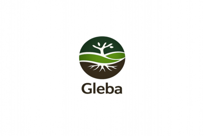

<div align="center">



# Gleba

**🌱 Logiciel professionnel gratuit de gestion de potager et verger 🌳**

[](LICENSE)
[](package.json)
[](https://nextjs.org/)
[](https://www.prisma.io/)
[](Dockerfile)

[Démo](http://demo.gleba.fr) • [Documentation](#installation-rapide-docker) • [Contribuer](CONTRIBUTING.md)

</div>

---

## 📋 À propos

**Gleba** est une application web professionnelle pour la **gestion complète de potagers et vergers**. Conçue pour les maraîchers, jardiniers amateurs et permaculteurs, elle combine planification intelligente, suivi de production et optimisation des ressources.

### 🎯 Mission

Démocratiser l'accès aux outils professionnels de maraîchage. Une agriculture locale, biologique et raisonnée accessible à tous, **gratuitement et pour toujours**.

### ✨ Pourquoi Gleba ?

- ✅ **100% Gratuit** - Aucun abonnement, aucune limitation
- ✅ **Open Source** - Code transparent, communauté active
- ✅ **Données privées** - Auto-hébergeable, vos données vous appartiennent
- ✅ **Agriculture bio** - Optimisé pour pratiques biologiques et permaculture
- ✅ **Professionnel** - 135+ espèces, 154 ITPs, données FranceAgriMer 2026

---

## 🚀 Fonctionnalités

### 🗓️ **Planification intelligente**
- **Assistant maraîcher** - Wizard pas-à-pas pour débutants
- **Calendrier interactif** - Semis, plantations, récoltes drag & drop
- **Rotations** - Plans pluriannuels avec cycles automatiques
- **ITPs** - Itinéraires techniques détaillés (espacements, durées)
- **Prévisions** - Récoltes estimées par mois/semaine

### 💧 **Gestion de l'eau**
- **Irrigations planifiées** - Calendrier automatique selon besoins
- **Tri par urgence** - Cultures critiques (>3j sans eau) en rouge
- **Consommation estimée** - Litres/semaine par culture et îlot
- **Historique** - Suivi des arrosages

### 📊 **Suivi de production**
- **Récoltes** - Saisie quantités + **valorisation économique** (€/kg)
- **Rendements** - Par planche, par espèce avec graphiques
- **Stocks** - Semences, plants, fertilisants éditables en direct
- **Dashboard** - Statistiques temps réel, comparaison années

### 🗺️ **Plan du jardin 2D**
- **Visualisation** - Planches, arbres, objets avec vraies dimensions
- **Drag & drop** - Déplacement intuitif
- **Sillons réalistes** - Espacements respectés selon culture
- **Validation physique** - Empêche cultures impossibles (trop large/longue)

### 🌾 **Base de données enrichie**
- **135 espèces** - Rendements, besoins NPK, prix marché bio
- **154 ITPs** - Calendriers, espacements rangs validés
- **155 variétés** - Infos semencières, fournisseurs
- **Sources fiables** - FranceAgriMer 2026, ITAB, guides bio

---

## 🎮 Démo en ligne

Testez Gleba sans installation :

**URL :** http://demo.gleba.fr *(si disponible)*
**Compte démo :**
- Email: `demo@gleba.fr`
- Mot de passe: `demo2026`

---

## 🐳 Installation rapide (Docker)

```bash
# 1. Cloner le projet
git clone https://github.com/GMS64260/gleba.git
cd gleba

# 2. Configurer
cp .env.example .env
# Éditer .env si nécessaire (DB, secrets)

# 3. Lancer
docker compose up -d
```

✅ L'application sera sur **http://localhost:3000**

**Comptes créés automatiquement :**
- **Admin** : Voir logs au premier démarrage
- **Démo** : `demo@gleba.fr` / `demo2026`

**Migration v1.0.0 automatique :**
- Import des 444 lignes de données enrichies
- Espèces avec rendements, NPK, prix circuit court bio
- ITPs avec espacements validés

---

## 📖 Guide rapide

### Premier lancement

1. **Connexion** avec compte démo ou admin
2. **Importer données démo** (optionnel) - Fichier `gleba_demo_data.json`
   - 24 planches sur 3 îlots
   - 76 cultures sur 2024-2026
   - 62 récoltes historiques
3. **Explorer** le dashboard
4. **Utiliser l'assistant** 🪄 pour créer votre première culture

### Navigation

- **Dashboard** - Vue d'ensemble, graphiques, calendrier
- **Cultures** - Liste, filtres, irrigation
- **Planification** - Cultures/récoltes prévues, semences, plants
- **Récoltes** - Suivi production, valorisation €
- **Plan jardin** - Vue 2D, positionnement
- **Stocks** - Semences, plants, fertilisants

---

## 🛠️ Stack technique

| Composant | Technologie | Version |
|-----------|-------------|---------|
| Frontend | Next.js | 16 |
| UI | shadcn/ui + TailwindCSS | - |
| Backend | Next.js API Routes | - |
| ORM | Prisma | 5.22 |
| Base de données | PostgreSQL | 16 |
| Auth | NextAuth.js | 5 |
| Container | Docker + Compose | - |
| Charts | Recharts | - |
| Icons | Lucide React | - |

---

## 📝 Licence et Copyright

**Copyright © 2024-2026 GMS64260 (Gleba Project)**

Ce logiciel est distribué sous **licence AGPL-3.0**.

### En résumé :
- ✅ Usage gratuit (personnel ou commercial)
- ✅ Modification et distribution autorisées
- ⚠️ **Obligation de partager les modifications** (même en SaaS)
- ⚠️ **Attribution requise** : "Powered by Gleba" visible dans l'interface
- ⚠️ Même licence AGPL-3.0 pour versions dérivées

Voir [LICENSE](LICENSE) et [COPYRIGHT.md](COPYRIGHT.md) pour tous les détails.

---

## 🙏 Remerciements

- **[Marc Pley](https://github.com/marcpley)** - [Potaléger](https://github.com/marcpley/potaleger), inspiration du projet
- **ITAB** - Guides techniques maraîchage bio
- **FranceAgriMer** - Données prix marché 2026
- **shadcn/ui** - Composants React élégants
- **Communauté open source** - Next.js, Prisma, et tous les contributeurs

---

## 📞 Contact & Communauté

- **Issues** : [GitHub Issues](https://github.com/GMS64260/gleba/issues)
- **Discussions** : [GitHub Discussions](https://github.com/GMS64260/gleba/discussions)

---

## 📜 Origine du nom

**Gleba** vient du latin *glēba* : « motte de terre », « sol cultivé ».

Ce terme évoque la connexion ancestrale entre l'homme et la terre qu'il cultive, le sol nourricier source d'abondance.

> *« Celui qui cultive sa glèbe avec soin récoltera l'abondance. »*

---

<div align="center">

**Fait avec 🌱 pour les jardiniers**

[⬆ Retour en haut](#gleba)

</div>
