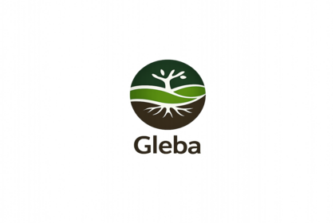

<div align="center">



# Gleba

**🌱 Logiciel professionnel gratuit de gestion de potager et verger 🌳**

[](LICENSE)
[](package.json)
[](https://www.npmjs.com/package/gleba-mcp-server)
[](https://nextjs.org/)
[](https://www.prisma.io/)
[](Dockerfile)

[Démo](http://demo.gleba.fr) • [Auto-hébergement](#-auto-hébergement-debianubuntu) • [Sauvegarde](#-sauvegarde-et-restauration) • [Mise à jour](#-mise-à-jour) • [Contribuer](CONTRIBUTING.md)

</div>

---

## 📋 À propos

**Gleba** est une application web professionnelle pour la **gestion complète de potagers et vergers**. Conçue pour les maraîchers, jardiniers amateurs et permaculteurs, elle combine planification intelligente, suivi de production et optimisation des ressources.

### 🎯 Mission

Démocratiser l'accès aux outils professionnels de maraîchage. Une agriculture locale, biologique et raisonnée accessible à tous, **gratuitement et pour toujours**.

### ✨ Pourquoi Gleba ?

- ✅ **100% Gratuit** - Aucun abonnement, aucune limitation
- ✅ **Open Source** - Code transparent, communauté active
- ✅ **Données privées** - Auto-hébergeable, vos données vous appartiennent
- ✅ **Agriculture bio** - Optimisé pour pratiques biologiques et permaculture
- ✅ **Professionnel** - 135+ espèces, 154 ITPs, données FranceAgriMer 2026

---

## 🚀 Fonctionnalités

### 🗓️ **Planification intelligente**
- **Assistant maraîcher** - Wizard pas-à-pas pour débutants
- **Calendrier interactif** - Semis, plantations, récoltes drag & drop
- **Rotations** - Plans pluriannuels avec cycles automatiques
- **ITPs** - Itinéraires techniques détaillés (espacements, durées)
- **Prévisions** - Récoltes estimées par mois/semaine

### 💧 **Gestion de l'eau**
- **Irrigations planifiées** - Calendrier automatique selon besoins
- **Tri par urgence** - Cultures critiques (>3j sans eau) en rouge
- **Consommation estimée** - Litres/semaine par culture et îlot
- **Historique** - Suivi des arrosages

### 📊 **Suivi de production**
- **Récoltes** - Saisie quantités + **valorisation économique** (€/kg)
- **Rendements** - Par planche, par espèce avec graphiques
- **Stocks** - Semences, plants, fertilisants éditables en direct
- **Dashboard** - Statistiques temps réel, comparaison années

### 🗺️ **Plan du jardin 2D**
- **Visualisation** - Planches, arbres, objets avec vraies dimensions
- **Drag & drop** - Déplacement intuitif
- **Sillons réalistes** - Espacements respectés selon culture
- **Validation physique** - Empêche cultures impossibles (trop large/longue)

### 🌾 **Base de données enrichie**
- **135 espèces** - Rendements, besoins NPK, prix marché bio
- **154 ITPs** - Calendriers, espacements rangs validés
- **155 variétés** - Infos semencières, fournisseurs
- **Sources fiables** - FranceAgriMer 2026, ITAB, guides bio

---

## 🎮 Démo en ligne

Testez Gleba sans installation :

**URL :** http://demo.gleba.fr *(si disponible)*
**Compte démo :**
- Email: `demo@gleba.fr`
- Mot de passe: `demo2026`

---

## 🐳 Installation rapide (Docker)

> Vous êtes pressé et avez déjà Docker ? Cette section. Sinon, voir [Auto-hébergement Debian/Ubuntu](#-auto-hébergement-debianubuntu) plus bas.

```bash
# 1. Cloner le projet
git clone https://github.com/GMS64260/gleba.git
cd gleba

# 2. Configurer
cp .env.example .env
# Éditer .env (a minima : NEXTAUTH_SECRET, ADMIN_PASSWORD, et NEXTAUTH_URL
# si vous accédez depuis une autre machine que le serveur)

# 3. Lancer
docker compose up -d
```

✅ L'application sera sur **http://localhost:3000**

**Comptes créés automatiquement :**
- **Admin** : email `admin@gleba.local`, mot de passe `$ADMIN_PASSWORD` (défaut : `changeme` — **à changer dans `.env` avant le premier lancement**)
- **Démo** : `demo@gleba.fr` / `demo2026`

**Référentiel agronomique chargé automatiquement :**
- 135 espèces enrichies (rendements, besoins NPK, prix circuit court bio)
- 154 ITPs (itinéraires techniques) avec espacements validés
- Sources : FranceAgriMer 2026, ITAB, guides bio

> Le chargement du référentiel est **idempotent** : il ne s'exécute qu'à la première installation et ne ré-écrase pas vos personnalisations lors des mises à jour.

---

## 🖥️ Auto-hébergement Debian/Ubuntu

Installation complète sur une VM Debian 12 (ou Ubuntu 22.04+) fraîche, avec HTTPS via Caddy.

### 1. Prérequis système

```bash
# Outils de base
sudo apt update && sudo apt install -y curl git ca-certificates gnupg

# Docker Engine + plugin Compose (procédure officielle)
sudo install -m 0755 -d /etc/apt/keyrings
curl -fsSL https://download.docker.com/linux/debian/gpg \
  | sudo gpg --dearmor -o /etc/apt/keyrings/docker.gpg
echo "deb [arch=$(dpkg --print-architecture) signed-by=/etc/apt/keyrings/docker.gpg] \
  https://download.docker.com/linux/debian $(. /etc/os-release && echo "$VERSION_CODENAME") stable" \
  | sudo tee /etc/apt/sources.list.d/docker.list >/dev/null
sudo apt update
sudo apt install -y docker-ce docker-ce-cli containerd.io docker-buildx-plugin docker-compose-plugin

# Vérifier
docker --version
docker compose version
```

> Pour Ubuntu, remplacez `linux/debian` par `linux/ubuntu` dans les deux URLs ci-dessus.

### 2. Cloner et configurer Gleba

```bash
sudo mkdir -p /var/www && cd /var/www
sudo git clone https://github.com/GMS64260/gleba.git
cd gleba
sudo cp .env.example .env
sudo nano .env
```

Variables **à modifier impérativement** dans `.env` :

| Variable | Action | Pourquoi |
|----------|--------|----------|
| `POSTGRES_PASSWORD` | Mettre un mot de passe long | Sécuriser la base |
| `NEXTAUTH_SECRET` | `openssl rand -base64 32` | Sessions NextAuth |
| `ADMIN_PASSWORD` | Mettre un mot de passe fort | Login admin |
| `NEXTAUTH_URL` | `https://gleba.example.com` | URL **publique** — sinon login impossible depuis l'extérieur |

### 3. Premier démarrage

```bash
sudo docker compose up -d
sudo docker compose logs -f app
# Attendre "Ready in X ms" puis Ctrl-C
```

L'app écoute sur `http://localhost:3000` (sur le serveur lui-même). Pour exposer en HTTPS sur Internet, passez à l'étape 4.

### 4. Reverse proxy HTTPS avec Caddy (recommandé)

Caddy gère automatiquement les certificats Let's Encrypt.

```bash
sudo apt install -y debian-keyring debian-archive-keyring apt-transport-https
curl -1sLf 'https://dl.cloudsmith.io/public/caddy/stable/gpg.key' \
  | sudo gpg --dearmor -o /usr/share/keyrings/caddy-stable-archive-keyring.gpg
curl -1sLf 'https://dl.cloudsmith.io/public/caddy/stable/debian.deb.txt' \
  | sudo tee /etc/apt/sources.list.d/caddy-stable.list
sudo apt update && sudo apt install -y caddy
```

Éditer `/etc/caddy/Caddyfile` :

```caddyfile
gleba.example.com {
    reverse_proxy localhost:3000
    encode gzip
}
```

```bash
sudo systemctl reload caddy
```

> Adaptez `gleba.example.com` à votre nom de domaine (DNS A/AAAA pointant vers la VM, ports 80 et 443 ouverts).
> Pensez à mettre la même valeur dans `NEXTAUTH_URL` du `.env`, puis `sudo docker compose up -d` pour appliquer.

### 5. Pare-feu (UFW)

```bash
sudo ufw allow ssh
sudo ufw allow 80/tcp
sudo ufw allow 443/tcp
sudo ufw enable
```

Le port 3000 **ne doit pas** être ouvert publiquement — Caddy lui parle en local.

---

## 💾 Sauvegarde et restauration

Toutes les données utilisateur (cultures, récoltes, élevage, compta…) vivent dans le volume Docker `postgres_data`. Sans backup, un crash de VM = perte définitive.

### Sauvegarde manuelle

```bash
cd /var/www/gleba
./scripts/backup.sh
# → dump créé dans /var/backups/gleba/gleba-YYYYMMDD-HHMMSS.dump
```

Variables disponibles :

| Variable | Défaut | Rôle |
|----------|--------|------|
| `BACKUP_DIR` | `/var/backups/gleba` | Dossier de destination |
| `RETENTION_DAYS` | `14` | Rotation (les dumps plus anciens sont effacés) |

### Cron quotidien (recommandé)

```bash
sudo crontab -e
```

Ajouter :

```cron
0 3 * * * cd /var/www/gleba && ./scripts/backup.sh >> /var/log/gleba-backup.log 2>&1
```

→ backup chaque nuit à 3h, log dans `/var/log/gleba-backup.log`.

### Restauration

```bash
cd /var/www/gleba
./scripts/restore.sh /var/backups/gleba/gleba-20260524-030000.dump
# Demande confirmation. Arrête le container app, restore, redémarre.
```

> **Avant un upgrade majeur**, faire un backup. C'est la procédure de rollback la plus fiable si quelque chose se passe mal.

---

## 🔄 Mise à jour

```bash
cd /var/www/gleba

# 1. Sauvegarder (toujours, avant toute mise à jour)
./scripts/backup.sh

# 2. Récupérer les nouveautés
sudo git pull

# 3. Purger le cache Next.js (sinon l'ancien build est servi)
sudo rm -rf .next

# 4. Rebuild + restart
sudo docker compose up -d --build app
```

Les migrations Prisma sont appliquées automatiquement au démarrage via `prisma migrate deploy` — aucune perte de données.

> ⚠️ **Si vous avez personnalisé le référentiel agronomique** (espèces, ITPs, variétés) directement en base, relisez les logs de démarrage après l'update : un éventuel script de migration de référentiel pourrait écraser ces valeurs. Le comportement est idempotent dans le cas standard.

---

## 📖 Guide rapide

### Premier lancement

1. **Connexion** avec compte démo ou admin
2. **Importer données démo** (optionnel) - Fichier `gleba_demo_data.json`
   - 24 planches sur 3 îlots
   - 76 cultures sur 2024-2026
   - 62 récoltes historiques
3. **Explorer** le dashboard
4. **Utiliser l'assistant** 🪄 pour créer votre première culture

### Navigation

- **Dashboard** - Vue d'ensemble, graphiques, calendrier
- **Cultures** - Liste, filtres, irrigation
- **Planification** - Cultures/récoltes prévues, semences, plants
- **Récoltes** - Suivi production, valorisation €
- **Plan jardin** - Vue 2D, positionnement
- **Stocks** - Semences, plants, fertilisants

---

## 🤖 Serveur MCP - Pilotez Gleba depuis l'IA

Gleba intègre un serveur [MCP (Model Context Protocol)](https://modelcontextprotocol.io) avec **39 outils** permettant de piloter votre ferme depuis **Claude Desktop**, **Claude Code**, **ChatGPT** ou tout client MCP compatible.

```bash
npx -y gleba-mcp-server
```

**Exemples de commandes en langage naturel :**
- *« Qu'est-ce que je dois faire au potager cette semaine ? »*
- *« Enregistre 3kg de tomates récoltées sur la planche S4 »*
- *« Combien d'oeufs mes poules ont pondu ce mois-ci ? »*
- *« Quel est mon chiffre d'affaires ce mois-ci ? »*

> Le code du serveur MCP est distribué séparément. Voir le [package npm `gleba-mcp-server`](https://www.npmjs.com/package/gleba-mcp-server) pour la documentation complète.

---

## 🛠️ Stack technique

| Composant | Technologie | Version |
|-----------|-------------|---------|
| Frontend | Next.js | 16 |
| UI | shadcn/ui + TailwindCSS | - |
| Backend | Next.js API Routes | - |
| ORM | Prisma | 5.22 |
| Base de données | PostgreSQL | 16 |
| Auth | NextAuth.js | 5 |
| Container | Docker + Compose | - |
| Charts | Recharts | - |
| Icons | Lucide React | - |

---

## 📝 Licence et Copyright

**Copyright © 2024-2026 GMS64260 (Gleba Project)**

Ce logiciel est distribué sous **licence AGPL-3.0**.

### En résumé :
- ✅ Usage gratuit (personnel ou commercial)
- ✅ Modification et distribution autorisées
- ⚠️ **Obligation de partager les modifications** (même en SaaS)
- ⚠️ **Attribution requise** : "Powered by Gleba" visible dans l'interface
- ⚠️ Même licence AGPL-3.0 pour versions dérivées

Voir [LICENSE](LICENSE) et [COPYRIGHT.md](COPYRIGHT.md) pour tous les détails.

---

## 🙏 Remerciements

- **[Marc Pley](https://github.com/marcpley)** - [Potaléger](https://github.com/marcpley/potaleger), inspiration du projet
- **ITAB** - Guides techniques maraîchage bio
- **FranceAgriMer** - Données prix marché 2026
- **shadcn/ui** - Composants React élégants
- **Communauté open source** - Next.js, Prisma, et tous les contributeurs

---

## 📞 Contact & Communauté

- **Issues** : [GitHub Issues](https://github.com/GMS64260/gleba/issues)
- **Discussions** : [GitHub Discussions](https://github.com/GMS64260/gleba/discussions)

---

## 📜 Origine du nom

**Gleba** vient du latin *glēba* : « motte de terre », « sol cultivé ».

Ce terme évoque la connexion ancestrale entre l'homme et la terre qu'il cultive, le sol nourricier source d'abondance.

> *« Celui qui cultive sa glèbe avec soin récoltera l'abondance. »*

---

<div align="center">

**Fait avec 🌱 pour les jardiniers**

[⬆ Retour en haut](#gleba)

</div>
